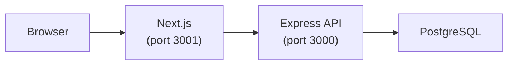

# Appofa

**Greek civic-engagement platform** — connecting citizens with their communities through articles, polls, suggestions, dream-team formations, person profiles, and manifests.

> Live at [appofasi.gr](https://appofasi.gr)

 

Appofa empowers Greek communities by giving residents a single place to:

- 📰 **Read & publish** local news and articles
- 🗳️ **Vote on polls** scoped to their municipality, prefecture, or country
- 💡 **Submit suggestions** and upvote solutions for real local problems
- 👥 **Build dream teams** — nominate and vote for ideal leadership roles per location
- 🏛️ **Explore person profiles** — public figures, candidates, and community leaders
- 📋 **Publish manifests** — structured civic commitments tied to locations

Content and voting rights are tied to a hierarchical location system (International → Country → Prefecture → Municipality), so every interaction stays relevant to the right community.

---

## Features

### Auth & Security
- JWT role-based access control (Admin / Moderator / Editor / Viewer)
- GitHub OAuth and Google OAuth social login
- bcrypt password hashing, helmet headers, rate limiting

### Content Management
- Article CRUD with moderation workflow (Personal / Articles / News / Video types)
- Article categories with dependent dropdowns
- Video embeds — paste a YouTube or TikTok URL for auto-filled title and embed
- Fast video post at `/videos/new` — paste a URL and publish in seconds

### Community Features
- Polls & statistics with Chart.js visualizations and auditable JSON export
- Suggestions & Solutions — post ideas/problems for locations, propose solutions, upvote/downvote
- User-to-user messaging system
- Hierarchical location system (International → Country → Prefecture → Municipality)

### Developer Experience
- Next.js 16 App Router + React 19
- Tailwind CSS styling
- Sequelize ORM with migrations
- Jest + Supertest test suite (in-memory SQLite)
- Docker + docker-compose support
- ESLint static analysis

### SEO & Analytics
- Dynamic `sitemap.xml` and `robots.txt`
- Canonical URLs, OpenGraph / Twitter meta tags, JSON-LD structured data
- Google Analytics GA4 integration
- Static categories page (`/categories`)

---

## Architecture



- **Auth layer** — JWT tokens + GitHub/Google OAuth (Passport.js)
- **ORM** — Sequelize with versioned migrations
- **Styling** — Tailwind CSS utility-first

---

## Quick Start

### Prerequisites
- Node.js 24+
- PostgreSQL 12+
- npm 10+

### Local Development

```bash
git clone https://github.com/Antoniskp/Appofa.git
cd Appofa
npm install
cp .env.example .env          # then edit with your DB credentials and JWT secret
npm run migrate               # apply all pending database migrations
npm run dev                   # start API on port 3000
```

In a second terminal:

```bash
npm run frontend              # start Next.js frontend on port 3001
```

Optional seed data (see [doc/PROJECT_SUMMARY.md](doc/PROJECT_SUMMARY.md) for sample accounts):

```bash
npm run seed
```

> **OAuth setup** — see [doc/OAUTH.md](doc/OAUTH.md) for GitHub and Google OAuth configuration.  
> **Analytics setup** — see [doc/GOOGLE_ANALYTICS.md](doc/GOOGLE_ANALYTICS.md) for GA4 configuration.  
> **SEO configuration** — see [doc/SEO.md](doc/SEO.md) for `SITE_URL`, sitemap, and JSON-LD details.

### Docker

```bash
docker-compose up -d          # starts PostgreSQL (port 5432) + API (port 3000)
```

Then start the frontend separately:

```bash
npm run frontend
```

---

## Scripts

| Command | Description |
|---|---|
| `npm run dev` | API server — development mode with auto-reload |
| `npm start` | API server — production mode |
| `npm run frontend` | Next.js dev server (port 3001) |
| `npm run frontend:build` | Next.js production build |
| `npm run frontend:start` | Next.js production server |
| `npm test` | Jest test suite with coverage |
| `npm run lint` | ESLint static analysis |
| `npm run seed` | Seed database with sample data |
| `npm run seed:locations` | Seed location hierarchy |
| `npm run migrate` | Run all pending migrations |
| `npm run migrate:up` | Apply next pending migration |
| `npm run migrate:down` | Rollback last migration |
| `npm run migrate:status` | Show migration status |
| `npm run migrate:article-types` | Migrate existing articles to new type field |

---

## Documentation

See [doc/INDEX.md](doc/INDEX.md) for the full documentation index.

### Core Documentation
- [Project Summary](doc/PROJECT_SUMMARY.md) — Holistic project overview
- [Architecture](doc/ARCHITECTURE.md) — System architecture and middleware
- [Security](doc/SECURITY.md) — Security best practices and considerations
- [Contributing](CONTRIBUTING.md) — How to contribute to the project

### Features
- [Poll & Statistics System](doc/POLL_FEATURE.md) — Complete poll system with voting, results, and Chart.js visualizations
- [Poll Audit Export](doc/POLL_EXPORT_AUDIT.md) — Privacy-preserving poll data export
- [Suggestions & Solutions](doc/SUGGESTIONS_FEATURE.md) — Idea/problem submission with upvote/downvote voting
- [Video Embeds](doc/VIDEO_EMBEDS.md) — Embed YouTube/TikTok videos in articles via URL paste
- [Fast Video Post](doc/FAST_VIDEO_POST.md) — One-paste video posting at `/videos/new`
- [Locations Model](doc/LOCATION_MODEL.md) — Hierarchical locations system
- [Location Sections](doc/LOCATION_SECTIONS.md) — Location section types, JSON shapes, and moderator management
- [OAuth Integration](doc/OAUTH.md) — GitHub and Google OAuth setup and usage
- [Google Analytics](doc/GOOGLE_ANALYTICS.md) — Analytics integration guide
- [Categories](doc/CATEGORIES.md) — Static categories page, JSON schema, and contribution guide
- [Message System](doc/MESSAGE_SYSTEM_IMPLEMENTATION.md) — User messaging feature
- [SEO](doc/SEO.md) — SEO configuration: sitemap, robots.txt, OpenGraph, and JSON-LD structured data

### Deployment & Operations
- [Deployment](DEPLOYMENT.md) — Pointer to VPS_SETUP.md (Nginx config, deployment process, port layout)
- [VPS Setup Guide](doc/VPS_SETUP.md) — Complete VPS deployment guide (Ubuntu/Debian)
- [Deployment Guide](doc/DEPLOYMENT_GUIDE.md) — Local, Docker, and cloud platform deployments
- [Upgrade Guide](doc/UPGRADE_GUIDE.md) — Migration and upgrade instructions
- [Migration Guide](doc/MIGRATION_GUIDE.md) — Google OAuth migration guide
- [Migrations](doc/MIGRATIONS.md) — Database migration reference
- [Node Upgrade Guide](doc/NODE_UPGRADE_VPS.md) — Node.js upgrade instructions for VPS
- [Troubleshooting](doc/TROUBLESHOOTING.md) — Common issues and solutions

### Development & Testing
- [API Testing Examples](doc/API_TESTING.md) — API usage and testing with curl
- [Poll Testing](doc/POLL_TESTING.md) — Poll system testing checklist
- [Message System Testing](doc/MESSAGE_SYSTEM_TESTING.md) — Message system testing guide
- [Article Types Testing](doc/ARTICLE_TYPES_TESTING.md) — Article type system testing
- [Dependency Updates](doc/DEPENDENCY_UPDATES.md) — Dependency management and security audits
- [Copilot Agents](doc/COPILOT_AGENTS.md) — AI agent configuration
- [Postman Collection](doc/postman_collection.json) — API testing collection

---

## Categories

The `/categories` page lists all platform content categories (Articles, News, Polls), rendered statically from [`config/articleCategories.json`](config/articleCategories.json). See [doc/CATEGORIES.md](doc/CATEGORIES.md) for the JSON schema and contribution guide.

**Suggest a new category** — open a pre-filled GitHub Issue:  
[https://github.com/Antoniskp/Appofa/issues/new?labels=category-suggestion](https://github.com/Antoniskp/Appofa/issues/new?labels=category-suggestion)

---

## Dependency Management

See [doc/DEPENDENCY_UPDATES.md](doc/DEPENDENCY_UPDATES.md) for guidance on updating dependencies, running security audits (`npm audit`), and the history of significant dependency upgrades.

---

## Contributing

Contributions are welcome! See [CONTRIBUTING.md](CONTRIBUTING.md) for guidelines, branching strategy, code style, and the PR process.

---

## License

Copyright (c) 2026 Antoniskp. All Rights Reserved.

This repository is made publicly available for transparency, audit, and contributions only. See the [LICENSE](LICENSE) file for details.

**Note**: No license is granted to use, copy, modify, merge, publish, distribute, sublicense, or sell copies of this software without explicit permission.

## Author
Antoniskp