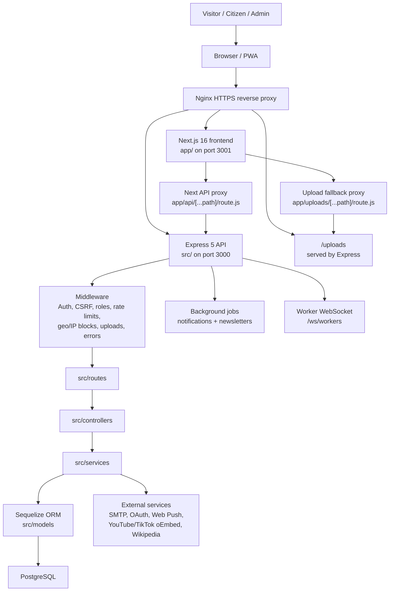
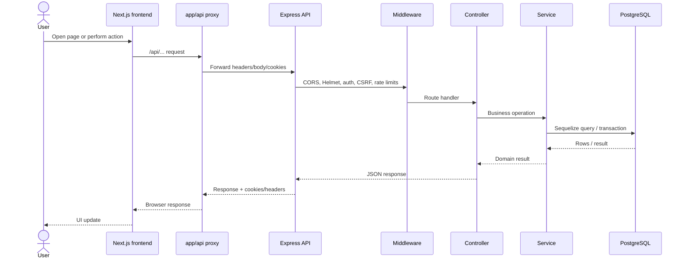
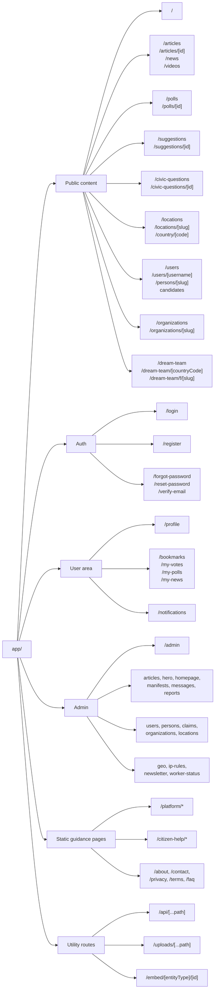
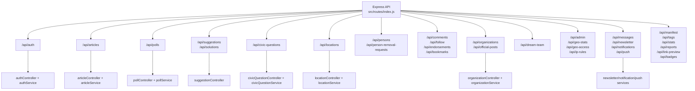
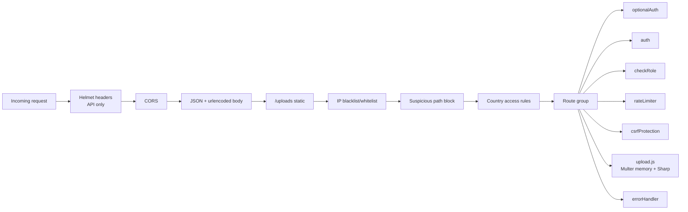
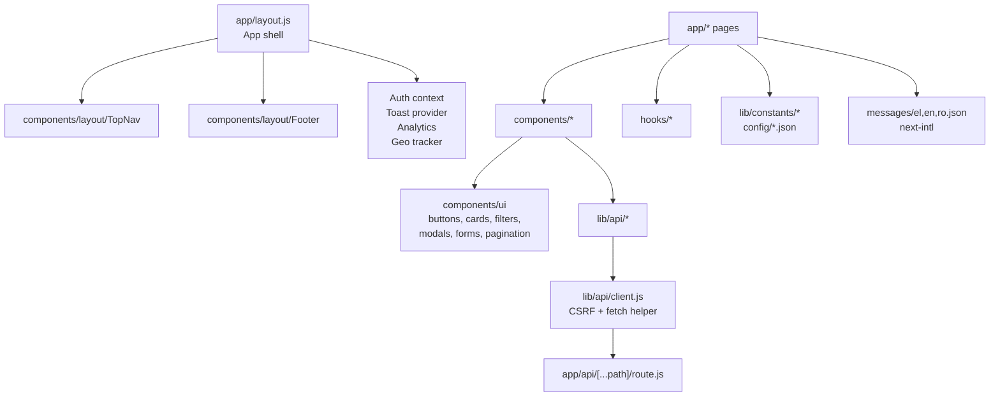
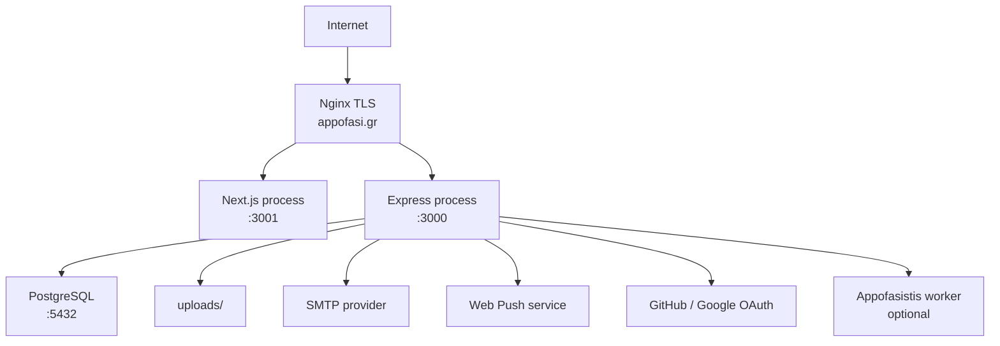

# Appofa Visual App Map

Generated: 2026-06-25
Source tree inspected: `C:\Users\ioanm\Documents\GitHub\Appofa`
Live site: https://appofasi.gr

This is a visual working map of Appofa. Keep it high-level enough to navigate the app, and use `doc/REPOSITORY_MAP.md` for the exhaustive file-by-file index.

## 1. System Map

## 2. Request Flow

## 3. Frontend Route Map

## 4. Backend API Map

## 5. Feature-To-Code Map

| Feature | Frontend | API routes | Controllers | Services | Main models |
|---|---|---|---|---|---|
| Auth, profile, OAuth | `app/login`, `app/register`, `app/profile`, `components/profile`, `lib/auth-context.js` | `authRoutes.js` | `authController.js` | `authService.js`, `oauthService.js`, `userService.js` | `User`, `UserBadge`, `Follow` |
| Articles/news/videos | `app/articles`, `app/news`, `app/videos`, `components/articles`, `lib/api/articles.js` | `articleRoutes.js` | `articleController.js` | `articleService.js`, `image*Service.js` | `Article`, `Tag`, `TaggableItem`, `Comment` |
| Polls | `app/polls`, `components/polls`, `lib/api/polls.js` | `pollRoutes.js` | `pollController.js` | `pollService.js` | `Poll`, `PollOption`, `PollVote` |
| Suggestions/solutions | `app/suggestions`, `components/SuggestionCard.js`, `lib/api/suggestions.js` | `suggestionRoutes.js`, `solutionRoutes.js` | `suggestionController.js` | partly controller-led | `Suggestion`, `Solution`, `SuggestionVote` |
| Civic questions | `app/civic-questions`, `components/civicQuestions`, `lib/api/civicQuestions.js` | `civicQuestionRoutes.js` | `civicQuestionController.js` | `civicQuestionService.js` | `CivicQuestion`, `CivicQuestionVote` |
| Locations/geography | `app/locations`, `components/locations`, `components/map`, `lib/api/locations.js` | `locationRoutes.js`, `geo*Routes.js` | `location*Controller.js` | `locationService.js`, `countryAccessService.js` | `Location`, `LocationRole`, `LocationSection`, `GeoVisit`, `CountryAccessRule` |
| People/profiles | `app/users`, `app/persons`, `app/candidates`, `components/user` | `personRoutes.js`, `authRoutes.js` public-user routes | `personController.js`, `authController.js` | `personService.js`, `userService.js` | `User`, `PersonRemovalRequest`, `UserLocationRole` |
| Organizations | `app/organizations`, `components/organization`, `lib/api/organizations.js` | `organizationRoutes.js`, `officialPostsRoutes.js` | `organizationController.js` | `organizationService.js` | `Organization`, `OrganizationMember`, `OrganizationRole`, `OrganizationAnalytics` |
| Dream team | `app/dream-team`, `components/dream-team`, `lib/api/dreamTeamAPI.js` | `dreamTeamRoutes.js`, admin routes | `dreamTeamController.js` | controller-led | `Formation`, `FormationPick`, `FormationLike`, `DreamTeamVote`, `GovernmentPosition` |
| Newsletter | `app/admin/newsletter`, `app/newsletter/unsubscribe`, `components/newsletter` | `newsletterRoutes.js` | `newsletterController.js` | `newsletterService.js` | `NewsletterSubscriber`, `NewsletterCampaign`, `NewsletterSendLog` |
| Notifications/push | `app/notifications`, `components/notifications`, `lib/api/notifications.js`, `lib/api/push.js` | `notificationRoutes.js`, `pushRoutes.js` | `notificationController.js`, `pushController.js` | `notificationService.js`, `pushService.js` | `Notification`, `PushSubscription` |
| Admin/ops | `app/admin`, `components/admin`, `lib/api/admin.js` | `adminRoutes.js`, `geoAccessRoutes.js`, `geoStatsRoutes.js` | mixed | `worker*Service.js`, `ipAccessService.js` | `WorkerToken`, `IpAccessRule`, `GeoAccessSetting` |

## 6. Data Model Map

```mermaid
erDiagram
  User ||--o{ Article : authors
  User ||--o{ Poll : creates
  User ||--o{ PollVote : casts
  User ||--o{ Suggestion : authors
  User ||--o{ Comment : writes
  User ||--o{ Formation : creates
  User ||--o{ Notification : receives

  Article ||--o{ Comment : has
  Poll ||--o{ PollOption : has
  Poll ||--o{ PollVote : receives
  PollOption ||--o{ PollVote : chosen

  Location ||--o{ Poll : scopes
  Location ||--o{ Suggestion : scopes
  Location ||--o{ CivicQuestion : scopes
  Location ||--o{ LocationSection : contains
  Location ||--o{ LocationRole : assigns
  Location ||--o{ UserLocationRole : moderates
  Location ||--o{ Location : parent_child

  Suggestion ||--o{ Solution : has
  Suggestion ||--o{ SuggestionVote : receives
  CivicQuestion ||--o{ CivicQuestionVote : receives

  Organization ||--o{ OrganizationMember : has
  Organization ||--o{ OrganizationRole : has
  Organization ||--o{ Poll : publishes
  Organization ||--o{ Suggestion : publishes
  Organization ||--o{ OrganizationAnalytics : tracks

  Formation ||--o{ FormationPick : includes
  Formation ||--o{ FormationLike : receives
  GovernmentPosition ||--o{ FormationPick : slot
  GovernmentPosition ||--o{ DreamTeamVote : receives

  NewsletterCampaign ||--o{ NewsletterSendLog : sends
  NewsletterSubscriber ||--o{ NewsletterSendLog : receives

  Tag ||--o{ TaggableItem : maps
```

## 7. Middleware Map

## 8. Frontend Module Map

## 9. Deployment Map

## 10. Where To Change Things

| Goal | Start here |
|---|---|
| Add a new public page | `app/<route>/page.js`, then add components under `components/` if reusable |
| Add an admin page | `app/admin/<area>/page.js`, `components/admin`, `lib/api/admin.js` or feature API client |
| Add a backend endpoint | `src/routes/<feature>Routes.js`, controller, service, tests |
| Add a database table | new `src/models/*.js`, update `src/models/index.js`, add `src/migrations/*.js` |
| Add a frontend API call | `lib/api/<feature>.js`, exported from `lib/api/index.js` |
| Add localized text | `messages/el.json`, `messages/en.json`, `messages/ro.json` |
| Add auth-only behavior | `src/middleware/auth.js`, `csrfProtection.js`, route ordering, `lib/api/client.js` |
| Add image upload | `src/middleware/upload.js`, `imageProcessingService.js`, `imageStorageService.js`, route controller |
| Add security headers/deployment behavior | `nginx/appofa.conf`, `config/nginx/appofasi.gr.conf`, `next.config.js`, `src/config/securityHeaders.js` |

## 11. Recommended Permanent Docs

Create or update these inside the repo:

| File | Purpose |
|---|---|
| `doc/VISUAL_APP_MAP.md` | This high-level visual map |
| `doc/ROUTE_MAP.md` | Generated-ish list of frontend routes and backend API route groups |
| `doc/DATA_MODEL_MAP.md` | Model relationship diagrams and table ownership |
| `doc/ARCHITECTURE.md` | Current system/deployment architecture, replacing older stale sections |
| `doc/REPOSITORY_MAP.md` | Exhaustive living index, updated after code changes |

## 12. Current Public Surface Summary

Major frontend route groups:

- `/`
- `/articles`, `/news`, `/videos`
- `/polls`
- `/suggestions`
- `/civic-questions`
- `/locations`, `/country/[code]`
- `/users`, `/persons`, `/candidates`
- `/organizations`
- `/dream-team`
- `/profile`, `/bookmarks`, `/notifications`, `/my-*`
- `/admin/*`
- static knowledge pages under `(statics)`

Major API route groups:

- `auth`, `articles`, `polls`, `suggestions`, `solutions`
- `locations`, `geo-detect`, `geo-stats`, `geo-access`
- `persons`, `organizations`, `official-posts`
- `comments`, `follow`, `endorsements`, `bookmarks`
- `civic-questions`, `dream-team`, `manifest`
- `newsletter`, `notifications`, `push`, `messages`
- `admin`, `reports`, `stats`, `tags`, `badges`, `link-preview`
